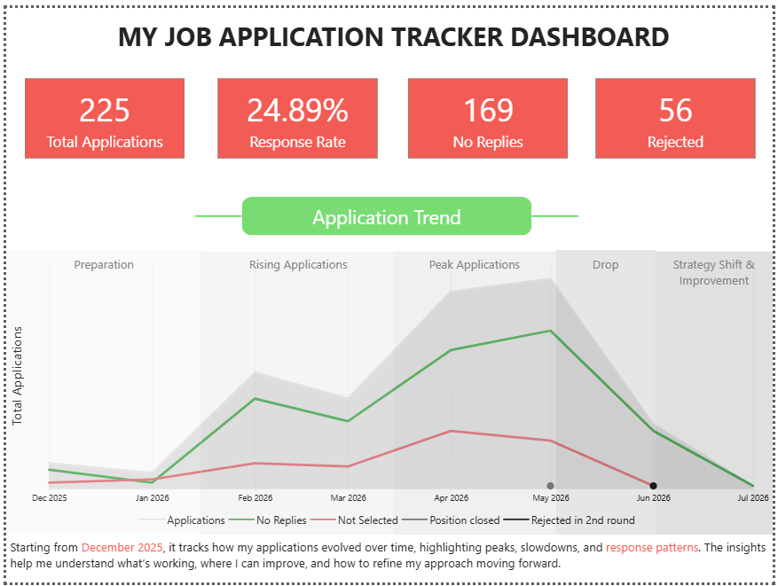
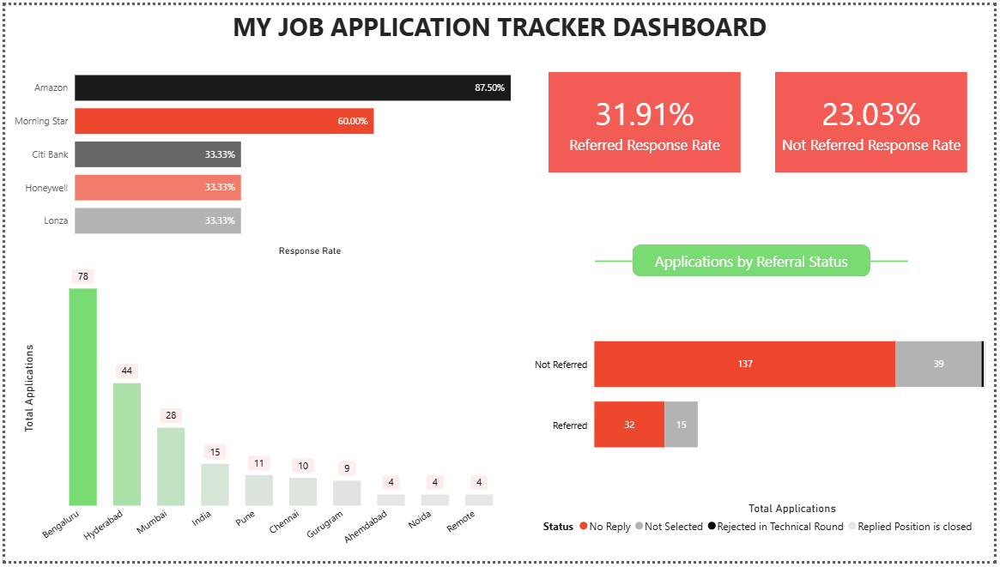

# My-Job-Application-Tracker-Project
## Project Overview 
Job searching is a long, repetitive process, and most applicants track it informally in a spreadsheet without ever analyzing it. This project turns my own real job search - 225+ applications tracked since December 2025 - into a full data analytics project covering companies, roles, locations, referrals, and response outcomes.

## Personal motivation 
While actively applying for Data Analyst and Business Analyst roles after graduating, I was already logging every application in a spreadsheet. Instead of leaving that data unused, I used it to practice the same skills I was applying for - Python, SQL, and Power BI - on a real, personal dataset.

## Problem Statement 
Job seekers apply to dozens or hundreds of roles but rarely analyze the pattern behind the outcomes — which companies respond, whether referrals actually help, and where applications are concentrated. Goal: Identify response patterns across companies, locations, and referral status to understand what's actually working in my job search.
**Goal:** Identify response patterns across companies, locations, and referral status to understand what's actually working in my job search.

## Dataset Source: 
My own job application tracker (self-maintained spreadsheet) 
Raw records: 226 rows × 12 columns 
After cleaning: 225 rows × 11 columns
Coverage: December 2025 – July 2026 
Multiple Indian cities 
100+ companies

## Tools & Technologies 
## Tools & Technologies
| Tool | Purpose |
|------|---------|
| Python (Pandas, NumPy) | Data cleaning & transformation |
| PostgreSQL | Business question analysis (SQL) |
| Power BI (DAX) | Dashboard & visualizations |

## Methodology 
**Data Cleaning** — Removed empty/duplicate rows, standardized blank statuses to "No Reply", removed the account-password column, fixed date formats 
**Feature Engineering** — Created Referral Status (Referred / Not Referred), standardized company and location names 
**SQL Analysis** — Business questions covering response rate, rejection rate, monthly trends, rolling 7-day application counts, and longest application streak 
**Dashboard** — 2-page Power BI report with KPI cards, trend analysis, and DAX measures

## Key Insights 
**📈 Referrals work** — Referred applications have a 31.91% response rate vs. 23.03% for non-referred applications 
**🏢 Amazon leads response rate** — Highest response rate (87.50%) among companies applied to multiple times 
**📍 Bengaluru is the top location** — Highest volume of applications by city, followed by Hyderabad and Mumbai 
**📉 Most applications get no reply** — The majority of applications end in "No Reply" status, more common than outright rejection 
**🔄 Application activity comes in bursts** — Clear peaks and drops in monthly application volume rather than a steady pace

## Data Refresh 
The dashboard isn't static — it can be updated with the latest applications anytime in two steps:

1. Run the Python script to pull the newest data from the Excel tracker into PostgreSQL: python load_jobs.py This reads the Excel file, updates PostgreSQL, and replaces the old data.
2. Open the report in Power BI and click Home → Refresh. The charts, KPI cards, and tables update automatically with the new data.

## Dashboard Preview

### 1. Overview

### 2. Deep Dive Analysis

##Project Structure 
Job-Application-Tracker-Analysis/ 
├── data/ 
│   └── Job Search Sheet.xlsx 
├── python/ 
│   └── load_jobs.py 
├── sql/ 
│   └── business_questions.sql 
├── dashboard/ 
│   └── My_job_application_tracker.pbix 
└── README.md

---

## Author
**Khushi Duggelwar**  
📧 khushivrao61@gmail.com  
🔗 [LinkedIn](https://linkedin.com/in/khushiduggelwar)  
💻 [GitHub](https://github.com/khushiduggelwar)
